# 

# yeti - YAML Editing Text Interface

A visual YAML editor

# Description

[YAML](https://yaml.org/) is a structured data format that is widely
used for its readability, especially in configuration files and other
software inputs. Most major languages have packages that parse their
data structures into and out of YAML. It is a format that often
bridges the gap between technical subject matter experts and software
engineers - for example, between clinical data SMEs and data system
architects.

To maintain its readability, YAML is finicky about indentation and
bullet characters. This is often manageable by using smart editors
that do indentation for you. However, there are groups of users who
could benefit from being able to write YAML who are less hip to
programming editors and file formats in general. These users can find
themselves wanting to make quick changes in a configuration, and wind
up in a frustrating cycle of bugs and fixes that they never asked for,
having made obscure errors of whitespace syntax.

_yeti_ is intended to help solve this problem and make YAML even more
friendly. It can be thought of as a visual editor for YAML. Users can
make their desired content changes, as well as comments, and
always produce syntactically correct YAML as output. _yeti_ also provides
key sorting and other features that editor plugins do not always have.

# Download/Install

_yeti_ is an [Electron](https://electronjs.org)-based stand-alone
application. Download and install the package for your system:

| Platform | URL | SHA1 sig |
| ------ | --- | ------- |
| MacOS | https://bintray.com/majensen0/yeti/download_file?file_path=yeti-0.1.4.dmg |  [SHA1](./dist/yeti-0.1.4.dmg.sha1) |
| Windows | https://bintray.com/majensen0/yeti/download_file?file_path=yeti-0.1.4-win.zip | [SHA1](./dist/yeti-0.1.4-win.zip.sha1) |

# Bugs and Feature Requests

Please report bugs and make feature requests as [Issues](https://github.com/CBIIT/yeti/issues) on this repository.

# Tutorial

## Open / Create

Use menu _File_ > _Open_ (Ctrl- or Cmd-O) to open a YAML file.

Use menu _File_ > _New_ (Ctrl- or Cmd-N) to create an empty YAML document.

### Display Features

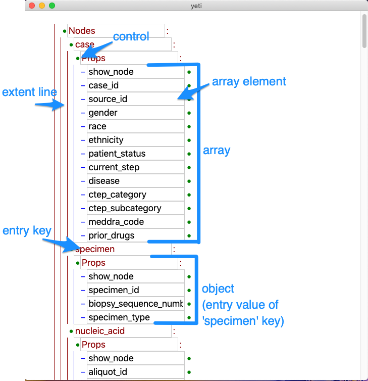

The image highlights the following items:
* Entity (object or array) extent line - the items to the right of this line are part of a single entity
* Object - key/value list entity
  * Object entry - consists of a text box containing entry key,  and an entry value entity following the colon
* Array - ordered list of entities
  * Array element - indicated by dash character
* Control - clickable character that enables insertion and deletion at that point in the document

### New File

A new YAML document appears as a single selector at the document root. Select `object` or `array` to set the root item. 

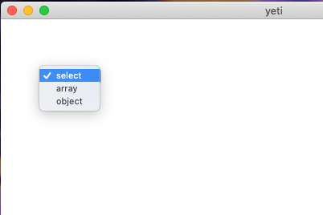

## Edit

### Create Items

Add items (scalars, objects, or arrays) are added to the document by clicking on the controls (green bullets) at the ends of an element, or by clicking into a text field and using _Edit_ > _New YAML Item Above_ and _Edit_ > _New Yaml Item Below_.

The control changes to an arrow indicating where the new element will appear. Click to insert above; shift-click to insert below.

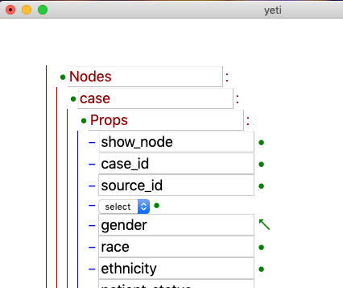 

The new element will appear as a `select` dropdown. Choose the item type to insert.

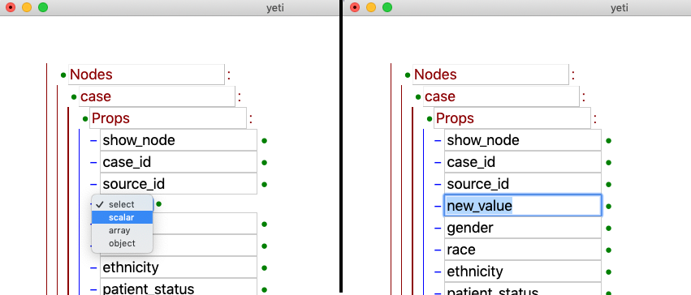

### Update Items

To update text items, place the cursor in the text box and edit as usual.

### Delete Items

To delete an item, hold down Cntl or Cmd while clicking the control. The control changes appearance to indicate delete mode.

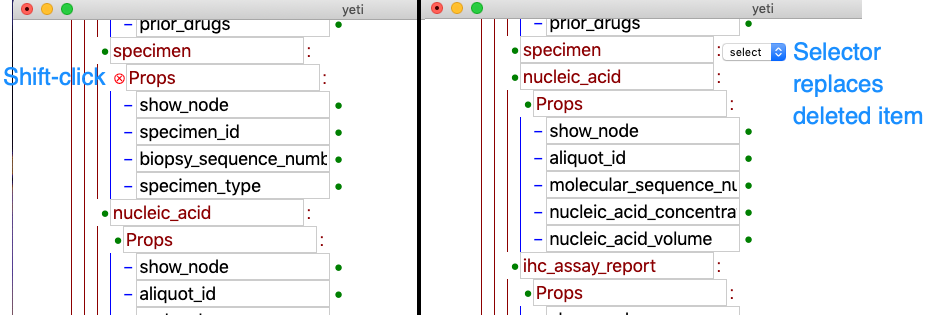

### Sort Items

To sort object entries alphabetically by their keys (within a single object), click into any key text box and select _Edit_ > _Sort This Level_ (F7).

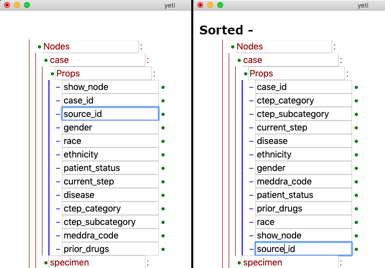

## Add/Modify Comments

To modify an existing comment, click on the comment text. The comment will appear within an editable text box. Click out of the text box to close the comment.

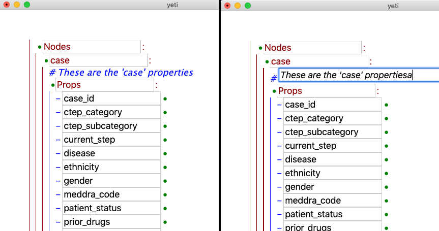

To add a comment near a given position in the document, click in a text box and select _Edit_ > _Add Comment_ (F12). A number of possible comment positions will appear, indicated by the pound character (#). Click on the desired position and enter the comment as desired. The unused positions will disappear after clicking away from the text box.

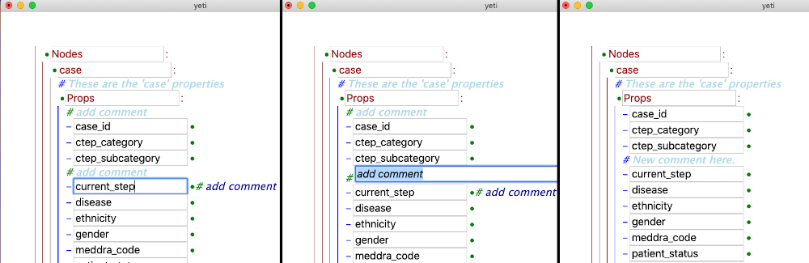

### Undo Changes

The usual _Edit_ > _Undo_ (Ctrl- or Cmd-Z) will undo text changes while entering text in text boxes. 

_Edit_ > _Undo YAML Edit_ (Ctrl- or Cmd-Shift-Z) will undo YAML structural edits, including insertion and deletion of YAML entities and sorting.

## View

To show or hide elements below an object key, double click that object key. An ellipsis (...) will appear to indicate the presence of hidden content.

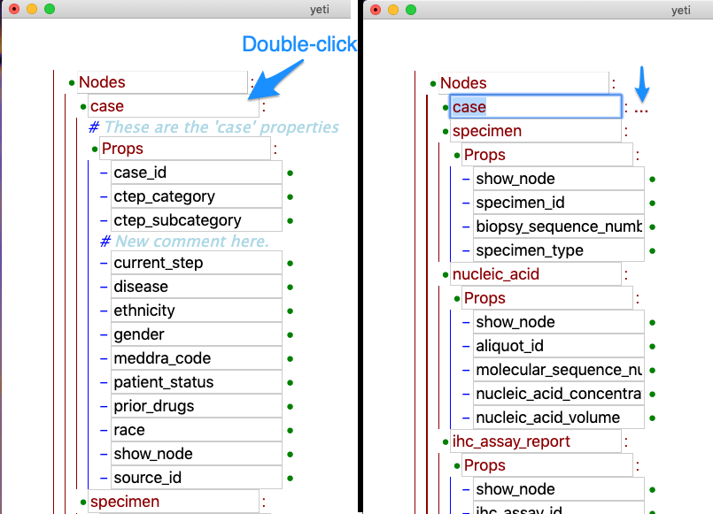

To show or hide all elements at or below a document level, click into a text box (scalar or object key) at the desired level and select _View_ > _Select / Hide Level_ (F8).

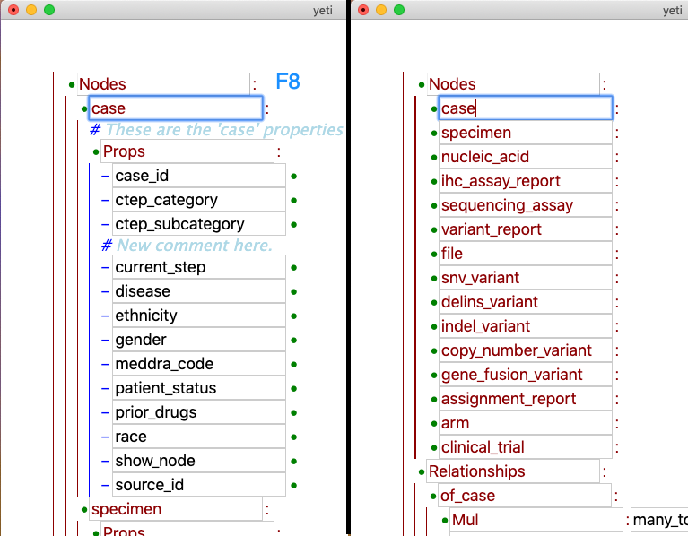

### Preview Document

To preview the YAML that will be saved, select _View_ > _Preview YAML_ (Ctrl- or Cmd-Y). YAML plain text will appear in a new window.

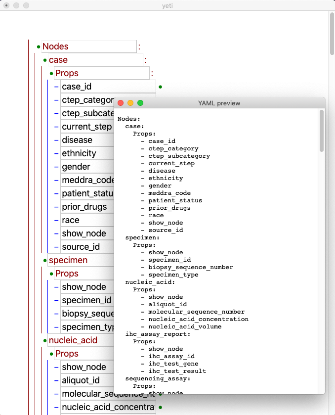

## Save / Close

Save or close the document by selecting _File_ > _Save_ (Ctrl- or Cmd-S) or _File_ > _Close_ (Ctrl- or Cmd-W) as usual.
