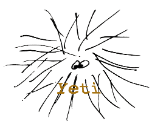

# 

# yeti - YAML Editing Text Interface

A visual YAML editor

# Description

[YAML](https://yaml.org/) is a structured data format that is widely
used for its readability, especially in configuration files and other
software inputs. Most major languages have packages that parse their
data structures into and out of YAML. It is a format that often
bridges the gap between technical subject matter experts and software
engineers - for example, between clinical data SMEs and data system
architects.

To maintain its readability, YAML is finicky about indentation and
bullet characters. This is often manageable by using smart editors
that do indentation for you. However, there are groups of users who
could benefit from being able to write YAML who are less hip to
programming editors and file formats in general. These users can find
themselves wanting to make quick changes in a configuration, and wind
up in a frustrating cycle of bugs and fixes that they never asked for,
having made obscure errors of whitespace syntax.

_yeti_ is intended to help solve this problem and make YAML even more
friendly. It can be thought of as a visual editor for YAML. Users can
make their desired content changes, as well as comments, and
always produce syntactically correct YAML as output. _yeti_ also provides
key sorting and other features that editor plugins do not always have.

# Download/Install

_yeti_ is an [Electron](https://electronjs.org)-based stand-alone
application. Download and install the package for your system:

| Platform | URL | SHA1 sig |
| ------ | --- | ------- |
| MacOS | https://bintray.com/majensen0/yeti/download_file?file_path=yeti-0.1.0.dmg |  [SHA1](./dist/yeti-0.1.0.dmg.sha1) |
| Windows | https://bintray.com/majensen0/yeti/download_file?file_path=yeti-0.1.0-win.zip | [SHA1](./dist/yeti-0.1.0-win.zip.sha1) |

# Bugs and Feature Requests

Please report bugs and make feature requests as [Issues](https://github.com/CBIIT/yeti/issues) on this repository.

# Tutorial

